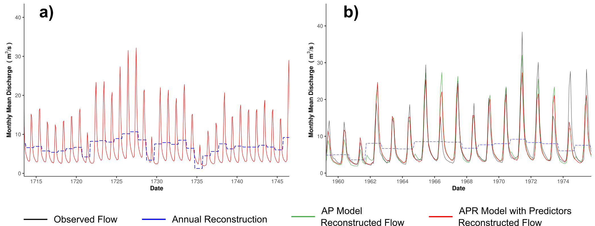

# Generating Monthly Paleostreamflow Reconstructions

This repository contains code designed to disaggregate and reconstruct monthly streamflows directly from annual streamflow reconstructions, reconstructions of global circulation, and potential differences among regional tree-ring chronologies related to tree species and geographic location. It is presented here to replicate the results in [Stagge et al. (2017)](http://) and to provide a reference for others wishing to use these methods to reconstruct streamflow records.  

An subset of the reconstruction is shown below as an example. Users can interact with the entire reconstruction at the [Monthly Paleostreamflow Explorer](https://jstagge.shinyapps.io/paleo_flow)

<figure>
 
 <figcaption>
 Reconstructed flows at the Logan river site for subsets of the (a) historical and (b) observed periods. Reproduces from Stagge et al. (2017).
 </figcaption>
</figure>

## Getting Started

These instructions will allow you to fit monthly streamflow reconstruction models on your local machine for testing purposes. All code is written in R. See Prerequisites and Running sections below for detailed instructions.

### Prerequisites

In order to run this code, you must install:
* [R for Statistical Computing](https://www.r-project.org/)

All necesary R packages will be installed automatically in the first file.

## Running the Code

### Running all scripts at once

Code is numbered in order of operations.  If you would like to simply recreate the results of [Stagge et al. (2017)](http://), you may run the following from any command line after installing R. For more detailed information about each file, see below:

```
Rscript 00_prepare_file_system.R
Rscript 01_process_streamflows.R
Rscript 02_mf_model.R
Rscript 03_pca_tree_ring.R
Rscript 04_ap_apr_model.R
Rscript 05_plot_ap_apr_model.R
Rscript 06_gof.R
```

### Running scripts step-by-step
The following file prepares the file system, installing any necesary packages and creating folders for model output.

```
Rscript 00_prepare_file_system.R
```
The next script downloads and processes USGS streamflow for the relevant sites. In this case, the relevant stream gauges are 10109001 and 10011500, located on the Logan and Bear rivers of Utah, respectively.
```
Rscript 01_process_streamflows.R
```
The following script fits the Monthly Fraction (MF) model described in [Stagge et al. (2017)](http://) and then reconstructs flow.
```
Rscript 02_mf_model.R
```
The following file runs a PCA analysis on regional tree-ring chronologies to be used as a predictor in the APR model.
```
Rscript 03_pca_tree_ring.R
```

These two scripts first fit and reconstruct flows using the Annual Percentile (AP) and Annual Percentile with Regression (APR) models, followed by code to plot the resulting model regression coefficients.
```
Rscript 04_ap_apr_model.R
Rscript 05_plot_ap_apr_model.R
```

Finally, a series of goodness of fit tests are run, in addition to several plots used to validate the model results:
```
Rscript 06_gof.R
```

## Reference and How to Cite

For any description of this methodology, please use the following citation (s):

* Stagge, J.H., Rosenberg, D.E., DeRose, R.J., and Rittenour, T.M. (2017) "Monthly paleostream-flow reconstruction from annual tree-ring chronologies." Journal of Hydrology.

* Stagge, J.H. (2017) "monthly_paleo: Code repository accompanying Stagge et al. (2017)." doi: 10.5281/zenodo.889892.

To refer to the PaleoAPR R package used in this study, please use the following citation:

* Stagge, J.H. (2017) "paleoAPR: Monthly streamflow reconstruction package for R." R package version 1.0. doi: 10.5281/zenodo.889892.

## Authors

* **James H. Stagge** - *Owner* - [jstagge](https://github.com/jstagge)

## License

This project is licensed under the MIT License - see the [LICENSE.md](LICENSE.md) file for details

## Acknowledgments

* Thank you to Justin DeRose for providing several tree-ring chronologies.
* Additional thanks to the International Tree-Ring Data Bank for providing further chronologies and global climate reconstructions. 

[](https://github.com/igrigorik/ga-beacon)
